# CodexFDE 复刻学习定向文档

- 调研日期：2026-09-25
- 调研对象：`vendors/CodexFDE`（工作台+课程仓库，submodule）与 `vendors/flowERP`（独立客户产品仓库，submodule）
- 目的：为"渐进式复刻 CodexFDE"提供第 0 步定向；后续喂给 grilling 与逐讲 TDD 循环

> 本文配图为 archify 生成的 SVG（跟随系统明暗主题自动切换），交互版 HTML 在 `diagrams/` 目录（浏览器打开，支持缩放、导览视图）。图 2、图 4 与图 1、图 3 同源，已合并呈现。

## 调研范围（读过/验证过的关键文件）

| 类别 | 文件 |
|---|---|
| 顶层叙事 | `README.md`、`AGENTS.md`、`FDE_SPEC.md`（存在，未逐行读）、`pyproject.toml`、`main.py`、`首次使用.cmd`、`打开工作台.cmd` |
| 课程文档 | `docs/README.md`、`docs/课程大纲-Codex-FDE行动营-个人研发自动化工作台.md`、`docs/课表｜Codex AI 工程交付行动营.md`、`docs/courses/课程蓝图.md`、`docs/courses/讲义阅读导航.md`、`docs/courses/行动卡索引.md`、`docs/courses/Codex-FDE双阶段故事链.md` |
| 架构/参考 | `docs/architecture/工作台范式与闭环建设.md`、`docs/reference/工作台Eval-Harness.md`、`docs/reference/实操手册执行与排错.md`、`docs/reference/daily-development.md` |
| 代码（粗读） | `workbench/cli.py`、`workbench/course_mainline.py`、`workbench/external_project.py`、`eval/harness.py`、`eval/README.md`、`agent/loop.py`、`agent/graph.py`、`agent/repair.py`（头部） |
| 讲义样例 | `docs/courses/L01/`（README、行动卡、手册目录）、`docs/courses/L04/`、`docs/courses/L00/`、`lesson-03-submission/`、`lesson-04-submission/` |
| FlowERP | `README.md`、`AGENTS.md`、`flowerp/`（inventory.py、idempotency.py、purchasing.py、sales.py 关键片段）、`eval/harness.py`、`eval/cases.py`（函数清单）、目录结构 |
| 实际运行验证 | `course-status`、`eval.harness --suite blocking`、`environment-check`（结果见第 5、8 节） |

以下所有路径默认相对 `vendors/CodexFDE/`（FlowERP 的标注 `flowERP/` 前缀）。

---

## 1. 项目是什么、为谁服务

**一句话建设主线**（全课程统一，多文档逐字一致）：

> "用 Codex，搭建个人 AI 研发工作台；通过工作台组织人与 AI 协同，持续开发 FlowERP。"（来源：README.md L3；AGENTS.md L5；docs/README.md L5）

- **它是**：一个教学项目（"Codex AI 工程交付行动营"的工作台与课程仓库，作者袁从德，极客时间训练营形态，大纲 L46-53），同时是一个**可运行的双产品仓库**：个人研发自动化工作台 + 电商 ERP 客户项目。最终成果"不是一份课程文档，而是两个不可拆分的可运行产品"（README.md L25-28）。
- **为谁服务**：面向"零基础或只有少量编程经验的学员"（大纲 L54）；仓库同时承担课程参考实现（reference implementation）角色——学生复刻的是过程，不是 clone 结果。
- **三层关系**（AGENTS.md L19-22，docs/README.md L123-127 同义）：
  1. **建设主线**：用 Codex 搭工作台，再通过工作台组织人与 Codex 协同开发 FlowERP（方法线）；
  2. **产品主线**：FlowERP 从主数据、库存、订单、采购到可操作界面逐讲增长（产品线）；
  3. **学习证据**：学生的判断、实现、失败、修订、互评、迁移和答辩（学习线）。
  约束："三条线必须互相引用，任何一条都不能单独充当课程成果"（大纲 L76）；"不得把个人工作台讲成 FlowERP 的员工门户"（AGENTS.md L5）。

**图 1｜三层关系与 FDE 三循环**——三条线互相引用，任何一条单独都不算课程成果；三个虚线边界即 FDE 三个嵌套循环（图 2 并入本图）· **交互版**：[diagrams/fde-layers.html](diagrams/fde-layers.html)


- **FDE 含义**：Forward-Deployed Engineering，落地为**三个嵌套循环**（大纲 L111-118）：
  - **现场循环**：FlowERP 的真实问题是什么、为什么现在做、何时不做（证据：来源、首次判断、具名决定、ERP 前后状态）；
  - **交付循环**：怎样让 Codex 在边界内把事情做对（证据：Spec、写集、前红、Diff、后绿、人工审核）；
  - **能力循环**：哪个重复失败值得升级为工作台能力并可在后续任务复用（证据：能力 Diff、失败前后对照、跨需求迁移）。
  红线："本项目不训练模型，不能把资产升级写成'模型自动进化'"（README.md L23）。

**图 2｜FDE 三个嵌套循环**——能力循环嵌在交付循环里，交付循环嵌在现场循环里。已并入图 1 的三个嵌套边界（现场 → 交付 → 能力），交互版可在"能力循环 / 交付循环"导览视图中分层聚焦。

**课程学习成果 CLO-1～6**（大纲 L137-144，复刻者可当作能力自评表）：

| 编号 | 可观察学习成果 | 主要直接证据 |
|---|---|---|
| CLO-1 | 接手陌生仓库，识别结构、约束、验证入口和责任边界，拒绝越权或伪造成功 | 接手报告、规则判决、风险说明 |
| CLO-2 | 将模糊业务请求压缩为可验收 Spec，完成范围受控的最小变更 | 需求判定、Spec、用例矩阵、Diff |
| CLO-3 | 从业务损失与不变量设计反例 Eval，借助 Harness/Hook/CI 形成可信质量证据 | 红绿记录、报告、退出码、失败后状态 |
| CLO-4 | 把失败压缩为修复任务，控制自动返工诚实收敛或安全停止 | Repair Task、Loop History、停止原因 |
| CLO-5 | 依据读写集和责任边界组织跨角色协作，保留冲突处理和具名人工审核 | 子任务合同、Graph Trace、人审决定 |
| CLO-6 | 在陌生环境运行、解释、交付并改进工作台驱动的 FlowERP 系统 | API/Web 对账、反馈闭环、冷启动、答辩 |

L01→L16 每讲都绑定主要 CLO（L01-L04→CLO-1/2，L05-L08→CLO-3，L09-L12→CLO-4/5，L13-L16→CLO-6，L16 收口 CLO-1～6）。

## 2. 设计思路：三件套与闭环判定

**建设范式**："个人研发工作台 = Harness + 记忆系统 + 工作流蒸馏"（AGENTS.md L47；architecture L5）。

| 组件 | 职责 | 首版代码位置（已核实存在） |
|---|---|---|
| Harness | 受控交付：输入目标/Spec/授权写集/预算/采用的记忆快照，执行保留事件、候选 Diff、Eval 报告、退出码与具名审核（architecture L61） | `workbench/initiative_workflow.py`（889 行）、`workbench/daily_delivery.py`、`workbench/task_store.py` |
| 记忆系统 | 把"带来源、适用边界和有效状态的经验"送回后续任务；candidate/active/superseded/revoked 四状态；SQLite 实现，不用外部向量服务（architecture L67-69） | `workbench/learning.py`（551 行，LearningStore） |
| 工作流蒸馏 | 从真实交付与失败提炼**版本化工程流程**（非模型训练）；候选→审核→试用→发布，失效可停用/替代（architecture L75-77） | `workbench/learning.py` 流程结构 + `workbench/evolution.py`；前端 `workbench_web/learning.js` |

**图 3｜三件套结构与跨事项闭环**——Harness 是枢纽，记忆与流程通过它进出；事项 N 的经验被事项 N+1 召回并采用，闭环才算成立（图 4 并入本图）· **交互版**：[diagrams/trio-closed-loop.html](diagrams/trio-closed-loop.html)


**"闭环"的判定标准——必须跨事项**（AGENTS.md L49 原文）："单次交付成功、事件持久化、反馈登记或资产登记，均不足以证明三者已闭环。完成须有跨事项证据：前一事项经验被后一事项召回，流程版本被明确采用，Harness 执行并保留 Eval 与人审结果，复用失败可追溯并触发修订或停用。"

**图 4｜跨事项闭环判定**——四步走通一次才算闭环：事项 N+1 召回事项 N 的经验 → 流程版本被明确采用 → Harness 执行并保留 Eval + 人审 → 复用失败可追溯并触发修订或停用。任一步缺失都只是"单次成功"。已并入图 3。

**已实现 vs 建设计划**（这是本项目文档诚信的典型样本，architecture L3、L25-33、L51）：
- 已有首版代码：记忆治理、跨事项召回（`initiative_workflow.py::_research` 调 `LearningStore.recall`）、采用快照、固定四阶段流程（"前置检查 → 实现 → Eval → 人审"）、首页"经验与流程"面板。
- 文档自认未完成（**文档声称**，未独立复跑）：
  - 回归 `Ran 30 tests, FAILED (errors=10)`，报错链是 `LearningStore.project` 对无项目事项抛 `ValueError`（architecture L46-49）；README.md L36 另记录 1 项失败 `test_changed_main_source_cannot_be_overwritten`（预期 review 实际 rework）。
  - `tests/` 中检索不到覆盖 `LearningStore`/`learning_binding` 等新增能力的专项测试（architecture L51）。
  - 未做浏览器操作验收、真实跨事项复用验收；"效果统计……重复失败是否减少仍标为'待测'"（architecture L53、L98）。
- 提炼给复刻者：该仓库把"代码存在"与"能力验收"严格分开表述，复刻时应继承这个纪律。

**一次可追溯交付链**（README.md L109-119 "60 秒理解这个项目"）：

```text
真实 ERP 需求
  → 明确范围与不可破坏规则
  → 形成可验收 Spec
  → 记录执行前检查；缺陷修复保留可复现失败
  → Codex 在允许写集内修改
  → 运行同一套阻断 Eval
  → 人工审核
  → 交付摘要与反馈
  → 将重复问题沉淀回工作台
```

配套的边界表述（README L121）："日常研发允许既有检查在执行前为绿，不会人为制造红灯。新需求仍需补充对应验证……课程隔离交付的前红、Diff、后绿要求按本讲合同执行。"——即**课程模式（教学用起始红）与日常模式（全绿基线起步，新需求补验证）是两条轨道**，`docs/reference/daily-development.md` L4 重复了同一口径。

## 3. 双产物目标：工作台（本仓库）与 FlowERP（独立仓库）

### 3.1 工作台侧（CodexFDE 仓库）

| 目录 | 职责（AGENTS.md L53-65 + README 仓库地图 L343-356） |
|---|---|
| `workbench/` | Spec 解析（`spec.py`）、任务 API、CLI（`cli.py`）、交付摘要与反馈、记忆系统、工作台服务 `workbench_server.py` |
| `eval/` | **工作台唯一质量入口**："Hook、CI、Loop 与 Graph 不复制测试逻辑，只读取 Harness 的退出码和 JSON 报告"（eval/README.md L3） |
| `agent/` | 失败报告→修复任务映射（`repair.py`）、有界 Loop（`loop.py`）、显式状态图（`graph.py`） |
| `workbench_web/` | 工作台统一界面，默认 :8001，"首页为唯一入口"，库 `workbench.db` |
| `harness_web/` | 可选完整 Harness 平台（:8010），非 L01-L16 通过标准 |
| `docs/courses/` | L00-L16 讲义、蓝图、行动卡、labs |

### 3.2 FlowERP 侧（flowERP 独立仓库）

领域模型（README.md L400-407，**代码已抽查核实**）：
- **主数据**：组织、用户、角色、商品、仓库、基础权限（`flowerp/master_data.py`、`identity.py`）。
- **库存**：入库幂等、批次、预占、释放、可用库存（`flowerp/inventory.py`）。已核实：`available = on_hand - reserved`（inventory.py L60 SQL 别名）；预占是**原子 guarded UPDATE**：`UPDATE stock_balance SET reserved=reserved+? ... WHERE ... on_hand-reserved>=?`（inventory.py L191-192），不足即 `InsufficientStock`。
- **销售**：订单创建、状态迁移（draft→confirmed→reserved→partially_shipped→shipped，每步 `InvalidTransition` 检查，sales.py L224/266/285/352）、取消释放预占、信用额度、审计。
- **采购**：采购单、**人工审批**（`purchasing.py` L146-151：`require("purchase.approve")` 且只有 `pending_approval` 可批；L204：未审批收货抛 `ApprovalRequired`）、审批后入库。
- **幂等**：`flowerp/idempotency.py` IdempotencyService——scope+key 唯一、sha256 请求指纹、24h TTL（已读实现）。
- **渠道与运营**：渠道订单、回调租约、备份、健康检查；`web/` 无密钥客户界面。

**业务不变量 5 条红线**（AGENTS.md L86-92，与 flowERP/AGENTS.md 逐字一致）：
1. 可用库存不得为负；预占必须原子化。✅代码核实
2. 同一个入库幂等键只能生效一次。✅代码核实
3. 订单状态只能按定义的状态机迁移；取消要释放预占。✅代码核实
4. 采购补货必须经过人工审批才能入库。✅代码核实
5. 任务、Eval 报告和反馈必须可追溯，失败不可伪装成成功。（工作台侧约束）

FlowERP 自带独立质量入口：自己的 `eval/harness.py`，**19 项 blocking ERP 检查**（已数：inventory_export_is_stable、stock_never_negative、receiving_is_idempotent、cancellation_releases_reservation、illegal_transition_is_blocked、purchase_requires_approval、purchase_request_preserves_reason、order_total_matches_lines、ecommerce_channel_order_is_idempotent_and_guarded、channel_callback_lease_is_exclusive_and_bounded、production_schema_invariants、multi_location_transfer_conserves_stock、stale_stock_count_is_blocked、sales_credit_and_atomic_reservation、backup_is_restorable、purchase_invoice_three_way_match、payable_aging_tracks_open_supplier_exposure、double_entry_fifo_and_subledger_reconciliation、bank_statement_control_and_reconciliation），另有 3 个 node --test 前端测试（flowERP/README）。

### 3.3 两仓库如何协作（进程边界）

- **不共享进程、不 import**："工作台通过独立进程启动客户服务，通过项目配置运行客户 Eval，不在进程内导入 ERP"（README.md L45）；AGENTS.md L53："本仓库不保留或导入该包"。
- **客户仓库定位**：`workbench/external_project.py::flowerp_root()` 解析顺序（已读代码 L13-37）：显式参数 → 环境变量 `FLOWERP_PROJECT_ROOT` → 读工作台 `workbench.db` 的 `harness_projects` 登记表（只读模式），匹配含 `flowerp/server.py` 的唯一登记目录；否则报错"请在工作台添加独立 FlowERP 仓库，或设置 FLOWERP_PROJECT_ROOT"。
- **客户命令转交**：`workbench.cli serve/demo/init/backup/doctor` 等在 cli.py L185-200 统一转交 `external_project.run()`，用**客户仓库自己的 `.venv`** 的解释器在客户目录执行 `python -X utf8 -m flowerp ...`（external_project.py L40-55）。
- **业务 Eval 委托**：`external_project.evaluate_case(name)` 在独立进程加载客户仓库的 `eval/erp_cases.py`（课程候选则用候选内的副本）执行单项检查，并断言 `flowerp.__file__` 不逃逸候选目录（L69-72）。
- **工作台侧屏蔽**：`eval/harness.py` 把 19 项 ERP 用例列入 `PROJECT_CASES`（L13），不带 `--case` 时默认套件**排除**它们（L70），所以工作台 10 项 blocking 全绿 ≠ ERP 业务通过——这正是"默认工作台绿灯不证明 ERP 业务通过"（AGENTS.md L55）的代码实现。
- **课程候选**：L04+ 隔离工作区把两仓库源码组合进临时目录，记录来源与逐文件 SHA-256（`.course/product-source.json` / `experiment-source.json`），候选修改不自动写回任何源仓库（course_mainline.py L14-20；实操手册 L23-29）。

**图 5｜进程边界协作全景**——两仓库不共享进程、不互相 import，一切协作走独立进程转交 · **交互版**：[diagrams/process-boundary.html](diagrams/process-boundary.html)



## 4. L00-L16 每讲地图

依据：`docs/课程大纲-….md`（唯一课程合同，L163-180 三线合同表 + L194-363 详细课表）与 `workbench/course_mainline.py::LESSONS`（机器可执行投影，**已逐讲读代码**）。大纲 L17：L00 "不计入正式 16 讲，也不产生工作台或 FlowERP 产品增量"。

**L00 课前准备**：装 Python 3.11/Git/VS Code/Codex CLI，克隆仓库、建 `.venv`、跑环境自检；产物 `lesson-00-submission/L00-环境自检.md`；明确"不得把 serve/demo/course-status 当作通过证据"（大纲 L33-40）。

**四阶段**（docs/README.md L22-27 阶段表；大纲 L148-153 周表）：

| 阶段 | 讲次 | 主题 |
|---|---|---|
| 工作台 V0（第一周） | L01-L04 | 接管、规则、Spec、受控执行 |
| 质量证据链（第二周） | L05-L08 | Eval、Harness、Hook、CI |
| 受控协作（第三周） | L09-L12 | Repair Task、Loop、Subagents、Graph/HITL |
| 产品化与反馈（第四周） | L13-L16 | Task API、Web、反馈、冷启动答辩 |

**图 6｜16 讲四阶段路线**——L04 是"自举换挡点"（从直接指挥 Codex 换成通过工作台协同），L16 是现场抽题冷启动 · **交互版**：[diagrams/lesson-route.html](diagrams/lesson-route.html)


**逐讲表**（标题取自大纲/课表逐字版本；ERP 增量、工作台增量、通过标准要点取自 course_mainline.py LESSONS L107-189 与大纲详细课表，每讲合同里的 evals 为该讲绑定的 Eval 名）：

| 讲 | 标题 | ERP 产品增量 | 工作台能力增量 | 通过标准要点（含 Eval） |
|---:|---|---|---|---|
| L01 | 以终为始：一次可验证的 AI 交付怎样完成？ | 无（FlowERP 尚未接入，只冻结为验证场） | 首份 WORKBENCH_SPEC、红灯测试、项目/任务/命令证据账与自举记录 | 要求回指痛点/建议/决定；保留前红、范围内 Diff、后绿；自举记录（`bootstrap_evidence_is_honest`） |
| L02 | 把仓库规则写进 `AGENTS.md` | 固化库存、订单、采购和审批边界（不开发 ERP） | 仓库规则、写入边界与 DoD | 越界请求被规则判拒绝；规则含正常路径与失败后不变状态 |
| L03 | 把模糊需求变成可验收 Spec | 签字确认库存导出合同（不写业务代码） | 六段式 Spec Schema 与最小解析器 | 六章节可解析、缺项明确报错；初稿/同伴歧义标注/修订稿（`spec_contract_rejects_ambiguity`） |
| L04 | 委托 Codex 执行一次最小变更 | **FlowERP 登记并首次交付库存导出** | 受控执行、写集检查、Diff 摘要与最小 Eval；自举换挡讲 | V0 先由非执行者独立验收（WB-L04-BOOTSTRAP），再由 V0 组织交付；导出与 ERP 权威库存一致（`inventory_export_is_stable`） |
| L05 | 先设计失败，再编写 Eval | 交付幂等入库 | 失败优先的单例 Eval | 同一幂等键重放不再次增加库存；保留修复前红灯/后绿灯（`receiving_is_idempotent`） |
| L06 | 用 Harness 汇总证据和等级 | 交付可用库存口径（available=on_hand-reserved 恒非负） | 统一 Harness、判决与退出码 | 阻断失败→非零退出码；报告 decision 与退出码一致（`stock_never_negative`） |
| L07 | 用 Codex Hooks 建立本地护栏 | 交付销售订单创建 | 提交前本地护栏（hook_staging 暂存→人审→安装） | 合法明细生成草稿单；非法数量被拒；Hook 调统一 Harness（`order_total_matches_lines`） |
| L08 | 把同一套 Eval 接入 CI | 交付原子预占（整单成败、缺货整单回滚） | 远程复验与证据信封 | 本地与 CI 同一 Eval 身份；A 假绿、B 可信红、C 可信绿（`sales_credit_and_atomic_reservation`、`ci_evidence_envelope_is_honest`） |
| L09 | 把失败报告翻译成修复任务 | 修复取消订单释放预占 | 失败报告→Repair Task 确定性映射 | 取消释放完整；任务回指原报告、含最小写集与复验命令（`cancellation_releases_reservation`） |
| L10 | 建立有停止条件的修复 Loop | 修复订单合法状态迁移 | 带预算与停止条件的 Loop | 非法迁移被阻断且状态不变；预算耗尽记录为未收敛而非成功（`illegal_transition_is_blocked`；命令 `agent.loop --max-rounds 3`） |
| L11 | 用 Codex 原生 Subagents 并行处理独立任务 | 交付采购申请 | 独立写集调度与串行集成 | 写集冲突的子任务不得并行；非法数量不产生采购申请（`purchase_request_preserves_reason`、`write_sets_reject_conflict`） |
| L12 | 用 Graph 显式表达状态、回退和人工审核 | 交付审批后入库 | 显式状态图、回退边与具名人审 | 未审批入库被阻断且库存不变；Graph 状态与 ERP 可对账（`purchase_requires_approval`；命令 `agent.graph --max-rounds 3`） |
| L13 | 把执行链路封装成任务 API | 通过 API 交付补货需求 | 可追溯 Task API 与异步状态 | API 返回 Task ID 而非伪称完成；全绿后仍停在人审（`delivery_evidence_and_review_controls`） |
| L14 | 让交付状态在 Web 面板可见 | 交付覆盖进销存财务入口的 ERP 操作页 | 可查询任务与工作台面板 | DOM/API/SQLite/ERP 四方对账；页面无凭据（`web_api_and_persistence_projection_agree`、`no_committed_secrets`） |
| L15 | 生成交付摘要并采集真实反馈 | 交付反馈驱动的进销存/财务小改进 | 交付摘要、反馈审核、Memory/RAG 与演进记录 | 原始反馈先审核再进候选；撤回/跨项目记忆不进默认上下文；检索不得改写阻断裁判（`raw_feedback_cannot_become_blocking`；要求 `--eval-case` 动态用例） |
| L16 | 在新环境接手，并完成现场新需求 | 现场交付此前未实现的受控小需求 | 冷启动、发布证据索引与迁移答辩 | 现场抽题且基线未实现；发布索引追溯需求/Diff/Eval/人审/风险（live_request=True，动态 Eval） |

注意两点结构约束（course_mainline.py `validate_mainline` L425-444 强制校验）：前置关系必须严格是上一讲；L15/L16 才允许 dynamic_eval_required；L16 必须 live_request。

**周退出门槛**（大纲 L148-153"退出门槛"列，可作四阶段验收总门）：

| 周 | 退出门槛 |
|---|---|
| 第一周 V0 | 每项需求可追溯到学生决定；同一测试由红转绿；工作台能记录自身建设任务和命令证据；Diff 不越界 |
| 第二周 V1 | 红灯稳定、修复后同命令转绿；假绿可被识别；阻断结论与退出码一致 |
| 第三周 V2 | 失败可压缩；循环有界；并行读写集无冲突；采购未经具名审批不能入库 |
| 第四周 V3 | DOM/API/SQLite/ERP 状态一致；进销存与财务对象不混账；反馈经过治理；陌生环境完成未预演小需求 |

**逐讲 Codex 角色 / FDE 循环 / 因果交接**（course_mainline.py LESSON_STORY L33-50，摘要；复刻每讲时可当作"本讲的教学设计意图"速查）：

| 讲 | Codex 角色 | FDE 循环 | 因果交接一句话 |
|---:|---|---|---|
| L01 | 需求访谈者与共同建造者 | 现场+能力循环 | 学生亲手造出 V0.1；不能用参考终态冒充学生成果 |
| L02 | 规则对抗者（新会话验证拒绝/放行） | 能力循环 | 先把边界写入仓库，后续执行才有跨会话约束 |
| L03 | 工作台共同建造者（Spec Schema） | 现场循环 | 签字 Spec 成为 L04 唯一输入，执行者不允许换题 |
| L04 | 协同换挡伙伴 | 交付循环 | 完成从直接用 Codex 搭台到通过工作台协同的自举换挡 |
| L05 | Eval 共同建造者与幂等入库修复者 | 能力循环 | 冻结失败优先 Eval 后，才授权 Codex 修复 ERP |
| L06 | Harness 共同建造者 | 能力循环 | 统一等级/报告/退出码成为共同裁判 |
| L07 | Hook 共同建造者与销售订单执行者 | 能力循环 | Codex 结束工作前由 Hook 自动复用同一 Harness |
| L08 | CI 证据链共同建造者 | 交付循环 | A 假绿/B 可信红/C 可信绿建立远端证据 |
| L09 | Repair 映射器共同建造者 | 能力循环 | Codex 只能消费可追溯 Repair Task，不吞长日志猜根因 |
| L10 | Loop 控制器共同建造者 | 交付循环 | 未收敛必须安全停止，不能把预算耗尽写成成功 |
| L11 | Subagents 调度能力共同建造者 | 能力循环 | 只读可并行，共享写集拒绝并行，主 Agent 串行集成 |
| L12 | Graph/HITL 共同建造者 | 交付循环 | 质量全绿不能替代采购具名审批，模型不得自批 |
| L13 | Task API 共同建造者 | 能力循环 | Codex 执行被封装为有身份、事件、合法状态的 Task |
| L14 | 工作台与 FlowERP Web 共同建造者 | 现场循环 | 页面只投影 API 与 ERP 权威状态，不生成假进度 |
| L15 | Feedback/Evolution 共同建造者 | 现场+能力循环 | 反馈具名晋级后由独立 Task 约束交付 |
| L16 | 完整工作台中的现场开发伙伴 | 三循环终验 | 随机需求走完 Spec—实现—Eval—人审—发布证据全链 |

## 5. 运行入口与验收机制

### 5.1 环境准备

- Python ≥3.10（课堂统一 3.11）；`python -m venv .venv` + `pip install -e .`（README L137-160）。**零第三方运行时依赖**（pyproject.toml `dependencies = []`，已核实），课程跟跑线只用标准库+SQLite。
- 脚本入口：`flowerp-workbench`（=workbench.cli）、`harness-workbench`、`codexfde`（pyproject [project.scripts]）。
- Windows 双击：`首次使用.cmd` → `workbench.setup_desktop`；`打开工作台.cmd` → `workbench.desktop`（已读两个 cmd）。
- `main.py`：一条命令自动启动工作台+FlowERP 两个服务（默认重启同数据目录旧工作台；`--reuse` 复用；自动重启仅 Windows）。

### 5.2 命令清单（workbench/cli.py 已通读）

| 命令 | 作用 | 备注 |
|---|---|---|
| `environment-check`（`--product` / `--product-root`） | 只读检查安装/解释器/包来源/页面资源；`--product` 加查独立 FlowERP 解释器 | 我在 conda 环境实跑返回 `ok:false`（virtual_environment 不通过）——**符合设计**，它要求仓库 `.venv` |
| `eval.harness --suite blocking` | 工作台唯一阻断入口；blocking 失败退出 1，报告写 `.runtime/reports/` | **实跑验证：10/10 通过、退出 0**；19 项 ERP 用例默认排除（PROJECT_CASES 机制） |
| `course-status`（`--require-baselines`） | 校验 16 讲合同、Eval 映射存在性、逐讲 Git 标签（course/lNN-start）的线性历史 | **实跑验证：contract_valid=true，course_ready=false**（本 checkout 无任何课程标签，16 个 baseline refs 缺失）；输出自带 `baseline_semantics: progression_gate` 与 constructibility 说明 |
| `course-contract --lesson N` / `course-spec --lesson N` | 查看/生成本讲可执行合同与交付 Spec（六段式，写 `.runtime/course/LNN/FDE_SPEC.md`） | L15/L16 强制要求 `--eval-case` |
| `course-prepare --lesson N` | 创建剥离本讲增量后的隔离工作区（worktree），`--source baseline|working-tree` | 起始红的来源 |
| `course-eval --lesson N` | 只跑该讲合同声明的 Eval | |
| `course-submit --lesson N --execute-code`（L4 起） | 按合同创建、执行（调用 Codex）、评测真实交付任务，成功停在 `review` | `--verify-only` 只复验、不得作为实现证据；`--bootstrap-task-id`（L04）、`--allowed-file` 收窄写集 |
| `course-baseline-audit/publish` | 审计/发布不可重写的逐讲课程标签（publish 需 `--confirm`） | 复刻者重建基线靠它 |
| `course-release-index` / `course-candidate-export/promote/cleanup` | 发布证据索引；候选 Patch 导出/应用/清理 | |
| `serve-workbench` | 工作台 :8001，库 `workbench.db`；`--enable-code-execution` 才允许网页授权执行 | cli.py L51-56 |
| `serve` | FlowERP :8000（经 external_project 转交独立仓库） | cli.py L47-50、L185-200 |
| `harness-serve` | 可选完整 Harness :8010 | 非大纲通过项 |
| `agent.loop --max-rounds 3` | "执行 → Eval → 生成修复任务 → 再执行"的有界循环；内部 `codex exec --json --sandbox workspace-write --ephemeral`（loop.py L28-31） | 不是自动成功按钮 |
| `agent.graph --max-rounds 3` | 显式状态机（DeliveryState：develop/…+trace+reviewer+review_decision 持久化，graph.py L15-25） | 与 Loop 区别：Graph 让回退与人工审核可见、状态可保存恢复 |
| `task-*`（create/submit/run/review/show/list） | 旧版直接操作当前目录的开发排错入口；README L362 明确不要在 CodexFDE 根目录用它交付 ERP | |
| `workbench.feedback summary` | 结构化反馈摘要 | |
| `unittest discover -s tests -v` | 全量测试（含需 FlowERP 的课程集成测试） | |

**每讲客观验收门（推荐组合）**：`environment-check` → `course-contract --lesson N` → `course-prepare` →（学生实现）→ `course-eval --lesson N` → `course-submit --lesson N --execute-code` →（独立复验候选）→ 具名 review。隔讲的"前红/范围内 Diff/后绿"证据在隔离候选里，不在终态仓库。

**图 7｜每讲验收门流水线**——`course-submit` 成功只停在 review 态，"待审核 ≠ 已接受" · **交互版**：[diagrams/lesson-gate.html](diagrams/lesson-gate.html)


**项目 Eval 命令的 JSON 报告合同**（`docs/reference/工作台Eval-Harness.md` L11，工作台复验候选时对项目检查命令的要求）：命令须输出完整 JSON 到 `{report_path}`（或 stdout）；必须含非空 `results`，每项有唯一 `name`、`level`（blocking/observing）、布尔 `passed`；`summary` 必须与分项一致，含 `total`、`passed`、`blocking_failed`、`observing_failed`、`decision`；阻断失败退出 1。配套的防伪规则（同文档 L7-9）：每次复验用新报告目录、旧失败不覆盖；执行异常、空结果、退出码矛盾或候选源码变化都不能形成通过结论；已绑定报告按候选源文件清单+文件哈希复核，"这不是安全沙箱或防篡改签名"。

**`course-submit` 返回处理**（实操手册 L77-82 速查表）：退出 0 且 `task.status=review` → 保存 task.id 与 isolation.path 后独立复验、交人审核（待审核≠已接受）；退出非零但有 task.id → 查 `task.error` 与事件，不重建任务；`rework`/`failed`/`dead_letter` → 保留终态记录再按讲次规则返工；`isolation` 为空 → 先查准备事件，禁止把控制仓库当候选。

## 6. 每讲学习材料结构（以 L01、L04 为例）

每讲目录（docs/courses/LNN/）标准结构：

| 材料 | 是什么 | L01/L04 实例 |
|---|---|---|
| `README.md` | 本讲导航：阅读顺序表、"附件什么时候用"表、排错入口指向 | L01 给 4 步路线：辅导资料→手册 1-2 步→手册 3-7 步→行动卡+手册第 8 步；个人记录放 `lesson-01-submission/` |
| `辅导资料.md` | 主讲材料：案例、机制、知识与判断方法 | 两讲均有 |
| `实践操作手册.md` | 操作主入口：位置、命令、预期结果、失败处理、提交要求 | L01 八步：准备隔离练习区→确认并签署需求→准备测试与有效红灯→确认计划并实现→审查改动与正式复验→建立自举记录→验证失败后状态→复核与提交，另有"故障定位与中断恢复""学习记录要求"两节（手册目录 grep 核实） |
| `行动卡.md` | 提交前快速核对：4 条行动 + "大纲四项合同"逐字引用 | 两讲均有；16 讲汇总在 `docs/courses/行动卡索引.md` |
| `prompts/` | 分阶段复制给 Codex 的提示词，需先填自己的路径/范围/事实 | L01：01-访谈并冻结范围 / 02-受控实现 / 03-复验并完成自举；L04：01-设计能力信封并留 Ticket A 红灯 / 02-独立验收 V0 再授权库存导出 / 02b-引用 Spec 执行 Ticket B / 03-独立复验 |
| `assets/` | 正文插图与来源记录 | 均有 |
| 讲次专属 | 按需 | L01：`tools/evidence.py`、`import_evidence.py`、`WORKBENCH_SPEC.md` 未签署样稿；L04：`scripts/check_inventory_delivery.py`、`skills/controlled-delivery-handoff/SKILL.md` |
| `slides/` | PPT，**不入 Git**（.gitignore + README L129），需向课程方取 | — |

**推荐阅读顺序**（L01 README 原文顺序）：先 README 路线表 → 辅导资料（看懂问题）→ 实践操作手册（动手，提示词到步骤再用）→ 行动卡（提交前核对）。docs/README.md L33-41 "每讲怎么学"抽象为五步：读问题留首次判断 → 读机制与反例 → 隔离工作区跑正常路径+主动制造失败 → 保存命令/退出码/失败后状态/范围内 Diff/复验 → 回讲义做第二次判断。

配套提交模板在 `docs/courses/labs/LNN/SUBMISSION.md`（labs 现有 L00、L02-L08，见第 9 节意外项）。

**三份学生参考资料**（docs/README.md L47-49，跨讲通用）：
- `docs/reference/个人AI研发工作台.md`：工作台边界、能力增长与 Codex 协作原则；
- `docs/reference/FlowERP领域模型与业务不变量.md`：库存、订单、采购和证据账的权威规则；
- `docs/reference/FlowERP接口与运行边界.md`：API、Web、持久化、冷启动与上线边界。
另有面向非程序员的导论 `docs/reference/从业务需求到上线：理解Spec与个人研发工作台.md`（docs/README.md L11），以及排错主入口 `docs/reference/实操手册执行与排错.md`。

**三个入口的边界**（README.md L83-91，跟跑者第一课）：

| 入口 | 端口 | 数据 | 角色 |
|---|---:|---|---|
| 个人研发工作台 | 8001 | `.runtime/workbench.db` | 日常研发、课程任务、交付状态与证据链（跟跑必做，唯一入口 `/`） |
| FlowERP 客户项目 | 8000 | `.runtime/flowerp.db` | 操作库存、订单、采购等 ERP 业务（跟跑必做） |
| 完整 Harness 平台 | 8010 | `.harness-runtime/` | 可选挑战，"不是 L01～L16 的通过条件" |

"**8001 是工作台，8000 是客户项目。** 两个界面、两个数据库、两个职责，不能混用。"（README L89）

## 7. 对学生（复刻者）的证据要求与红线

**"参考仓库已实现 ≠ 学生成果"**：
- "参考仓库已经实现、Agent 自述'完成'、一张绿色截图，都不能替代你亲手留下的红灯、修订和复验记录。"（docs/README.md L43）
- "参考仓库终态、模型总结、最终截图和组内口头说明均不能单独证明学生达成。"（大纲 L182）
- `--verify-only` 只复验已有候选，"不能作为学生亲手实现本讲增量的证据"（README L328；cli.py L107）。
- 机器侧同样设防：`course-status` 的 `baseline_semantics=progression_gate` 输出明说"标签线性只证明门闩基线存在，不证明产品缺能力切片。学员实现证据看隔离工作区执行前红、范围内 Diff、执行后绿"（course_mainline.py L513-517）；AGENTS.md L85："L04+ 起始红由隔离工作区剥离本讲增量保证；PROGRESSION.json 只是讲师侧辅助门闩，终态跟跑仓库不提交该文件。"

**每讲必须留下的证据**（大纲 L182 + 课程蓝图 L146）：可复现输入、预期、实际、退出码或权威状态、稳定身份、修订前后版本；工程是否通过与学生是否掌握分开记录（"可独立／需提示／尚未达成"）。docs/README.md L39-40 要求具体保存"命令、退出码、失败后权威状态、范围内 Diff 和复验结果"。

**不可破坏的业务规则**：见第 3.2 节 5 条；AGENTS.md"修改约束"另要求：新业务规则至少一个正常路径+一个失败路径用例（DoD L117）；不删除失败证据；不提交 `.env`/密钥/运行数据库/报告。

**lesson-03-submission / lesson-04-submission**（仓库根目录，**已读**）：这是随仓库提供的**样例/模板提交**，演示学生应留什么证据——
- `lesson-03-submission/decisions.md`：首次判断（保留原文）、信息来源与确认状态表、待追问问题、候选取舍及理由（D01 八列导出、D02 空数据保留表头，状态均"待确认"，确认处标"角色练习"）；`FDE_SPEC.md` 是签署产物样例；`missing-section.md` 是缺字段反例（供解析器报错验证）。
- `lesson-04-submission/WB-L04-BOOTSTRAP.md`：L04 前置的"工作台 V0 建设与复验合同"，即 `course-submit --lesson 4` 要求的 `--bootstrap-task-id` 对应任务的文档底稿（由非执行者独立验收 V0 后才能启动库存导出交付，course_mainline.py L123-126）。

**申报/叙事诚信红线**（AGENTS.md L38-43，对复刻者的警示意义在于"不要把复刻说成已达成"）：不得用模拟数据、截图、Agent 自述或参考仓库测试结果补齐证据；缺失证据只能标"待建设"。

## 8. 对复刻者的启示（综合判断，非仓库原文）

1. **从 L00 环境自检起步，且要新建 `.venv`**。实跑证明 `environment-check` 在系统/conda Python 下返回 `ok:false`（virtual_environment 检查），文档口径是仓库 `.venv` + `pip install -e .`。macOS/Linux 侧文档明显弱于 Windows（README 大量 PowerShell 示例；`main.py` 自动重启仅 Windows，macOS 要 `--reuse`）——复刻时需要自己补 macOS 口径。
2. **本 checkout 没有任何 `course/lNN-start` 标签**（实跑 course-status 证实 16 个全缺，`course_ready=false`）。渐进式复刻要么用 `scripts/build_course_baselines.py` / `course-baseline-audit/publish` 自建基线链，要么接受"终态参考 + 自建隔离练习"路线，但那就放弃了机器门闩。这是复刻决策里最先要磨的点。
3. **工作台 V0 四讲（L01-L04）是自举期，也是最值得逐 TDD 复刻的一段**：L01-L03 学生直接监督 Codex 造工作台（Spec→红灯→实现→自举），L04 先验收 V0 再由 V0 组织首次 FlowERP 交付（"换挡点"，课程蓝图 L27）。复刻者应把 L01 的 lesson-01 证据账（初始化/项目登记/任务账/命令证据账/状态检查）当作第一个可测切片，而不是从 workbench/ 终态 90+ 个模块倒推。
4. **FlowERP 从 L04 登记登场**：L01-L03 ERP 只"冻结边界"不写代码；L04 起 `course-submit` 才需要独立 FlowERP 仓库 + 它自己的 `.venv` + 登记或 `FLOWERP_PROJECT_ROOT`。复刻者可以先把工作台复刻到 L03 再准备 FlowERP，两边解耦。
5. **可作为每讲客观验收门的命令**：`eval.harness --suite blocking`（工作台 10 项，实跑通过）+ `course-contract/course-eval --lesson N`（合同绑定 Eval）+ L04 起 `course-submit`（产出 `review` 态任务+隔离候选）+ FlowERP 侧自己的 19 项 blocking。ERP 业务绿灯与工作台绿灯是两套，别混。
6. **每讲教学增量 = ERP 增量 × 工作台增量 × 因果**，已由 `course_mainline.py::LESSONS` 机器化。复刻时建议直接把这 16 个 dataclass 合同当作 TDD 的 fixture/测试起点（`test_course_mainline.py`、`test_course_outline_alignment.py` 已存在），先让合同测试红、再补实现。
7. **记忆系统/工作流蒸馏（L15 附近的能力）是"建设计划"成分最高的区域**：文档自认有回归失败、无专项测试、未做真实跨事项验收（第 2 节）。复刻时应按"最小可交付闭环六步"（architecture L81-87）重走，不要从 LearningStore 终态倒推。
8. **风险清单**：
   - Windows-first 的路径/编码约定（`-X utf8`、`.cmd`、`$env:`）需要一次性做 macOS 适配决策；
   - 课程候选"组合两仓库源码"是过渡态（实操手册 L29 自认"仍待迁移为两个独立项目候选"），复刻若追求干净边界可改为真正的双项目候选；
   - `docs/courses/` 只有 L00-L08 与 L16 的目录（第 9 节），L09-L15 只有大纲/合同没有讲义，复刻这些讲要靠大纲+LESSONS 合同+labs 模板自行组织 lesson 内容——这正好契合用户"每讲有 lesson 内容"的诉求，但要明白参考仓库本身也不完整；
   - 依赖 Codex CLI 的命令（`course-submit --execute-code`、`agent.loop/graph`）在没有模型访问权的环境会失败，验收门要分层：纯本地门（unittest、eval.harness、course-status） vs 需 Codex 门。

**建议的复刻推进顺序**（综合判断，供 grilling 磨决策）：

| 阶段 | 内容 | 对应原课程 | 客观完成标志 |
|---|---|---|---|
| 0 | 双仓库环境自检：CodexFDE `.venv` + `pip install -e .`；flowERP `.venv`；`environment-check` 与 `environment-check --product` 双绿 | L00 | 两条命令 `ok: true` |
| 1 | 决策：是否重建 `course/lNN-start` 基线链（影响整条渐进式路线） | 讲师侧工程 | course-status `course_ready: true` 或明确放弃该门 |
| 2 | 工作台最小自举：任务账、命令证据账、项目登记、状态检查，从红灯测试开始 | L01 | 同一测试由红转绿 + 自举记录 |
| 3 | 仓库规则 + Spec 解析器（六段式、缺项报错） | L02-L03 | `spec_contract_rejects_ambiguity` 通过；越界请求被规则拒绝 |
| 4 | V0 受控执行：写集检查、Diff 摘要、最小 Eval；首次委托交付库存导出（此时引入 flowERP） | L04 | `course-submit --lesson 4` 得 `review` 态任务 + 候选复验绿 |
| 5 | 质量链：失败优先 Eval → Harness 分级 → Hook → CI | L05-L08 | flowERP 19 项 blocking 在独立仓库可跑；本地/CI 同一入口 |
| 6 | 协作编排：Repair Task → Loop → Subagents 写集 → Graph/HITL | L09-L12 | `agent.loop`/`agent.graph` 收敛与安全停止记录 |
| 7 | 产品化：Task API → Web 面板 → 反馈/记忆/检索 → 冷启动 | L13-L16 | 发布证据索引 + 冷启动现场小需求 |
| 8（并行支线） | 记忆系统与工作流蒸馏最小闭环（六步，architecture L81-87） | L15 能力域 + 建设规格 | 跨事项召回-采用-复验-失效证据链走通一次 |

**图 8｜复刻推进顺序**——主线 0→7 顺序推进，阶段 8 是可并行的支线 · **交互版**：[diagrams/replication-roadmap.html](diagrams/replication-roadmap.html)


原则性提醒：每阶段先让"合同测试"红（course_mainline 合同、eval 用例、flowERP 业务不变量），再实现；保留每阶段前红/范围内 Diff/后绿的证据目录，这就是课程所说的"学习证据"第三条线的复刻版。

## 9. 意外发现 / 文档-代码差异清单（调研中核实）

1. **课程基线标签全缺**：`git tag` 为空，course-status 报 16 个 `course/lNN-start` 缺失（实跑）。
2. **L09-L15 讲义目录缺失**：`docs/courses/` 只有 L00-L08、L16；但 `讲义阅读导航.md` 与 `行动卡索引.md` 都链接到 `L09/辅导资料.md` 等——**当前是死链**。L09-L15 的"实践操作手册"同样不存在（行动卡索引链到 `L09/实践操作手册.md`）。
3. **课表与大纲的 L01 内容口径不一致**：`课表` L01 核心内容是"环境检查 + 四段式接手报告"，而大纲 L01 详细课表是"需求访谈 → WORKBENCH_SPEC → 红灯测试 → V0.1 → 自举"。大纲 L3 只要求**标题**与课表逐字一致（标题确实一致），但内容口径的漂移值得注意；复刻应以大纲+course_mainline 为准。
4. **labs 提交模板不全**：`docs/courses/labs/` 只有 L00、L02-L08（无 L01、L09-L16 的 SUBMISSION 模板）。
5. **README 记录的回归失败未经我复跑**：README L36 的 `test_changed_main_source_cannot_be_overwritten` 失败与 architecture 的 30 项 10 错误均为文档声称；我只验证了 blocking Eval 10/10 通过。
6. **命名陷阱**：`--report-path` 属于 `eval.harness`，`--report` 属于 `workbench.ci_evidence`（实操手册 L100 专门提示）；`workbench.cli serve` 名义上是"工作台 CLI 的命令"，实际转交 FlowERP——端口/职责表（8001 工作台 / 8000 客户 / 8010 可选）必须记牢。
7. **flowERP 仓库自带 `MIGRATION.json`** 记录迁入来源与摘要（"保留 19 项 ERP 阻断检查"，flowERP/README），说明双仓库拆分是近期完成的迁移，CodexFDE 里已无 `flowerp/`、`web/` 业务目录（已核实顶层结构）。
8. **工作台 blocking 只有 10 项**而非 Eval 全集 31 项（29 blocking + 2 observing）：PROJECT_CASES 机制默认跳过 19 项 ERP 用例 + 2 项 harness 平台用例也未进 blocking 默认集（plugin_lifecycle 等 10 项为默认 blocking 集，实跑 total=10 与之吻合）。
